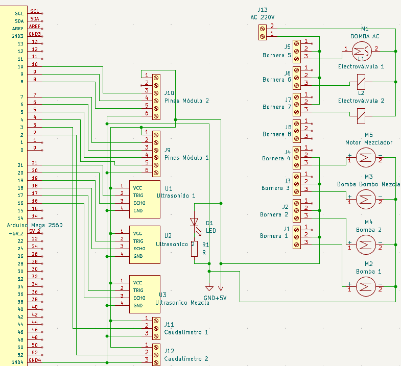
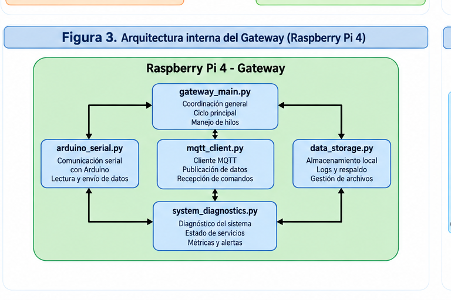
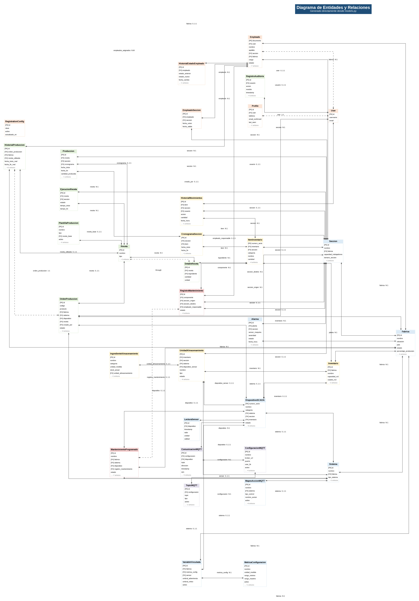
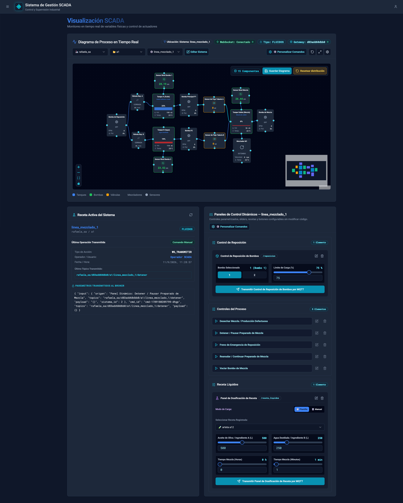
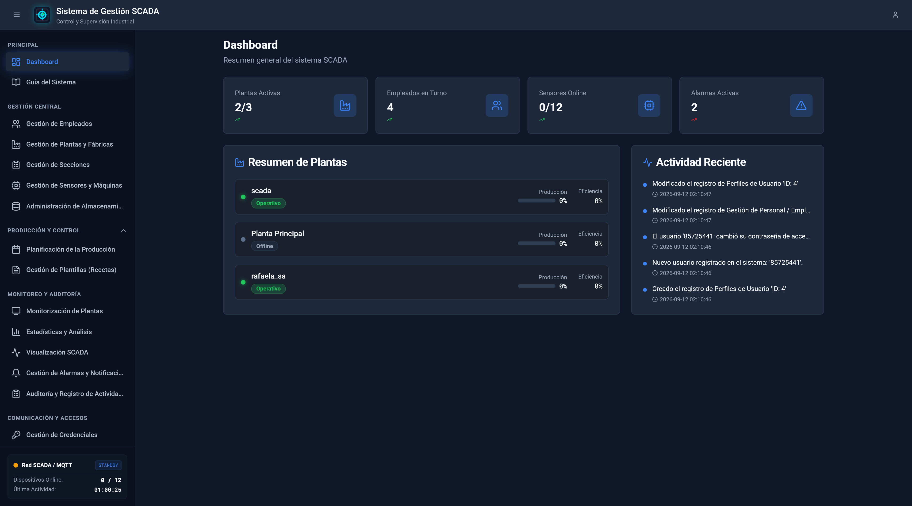
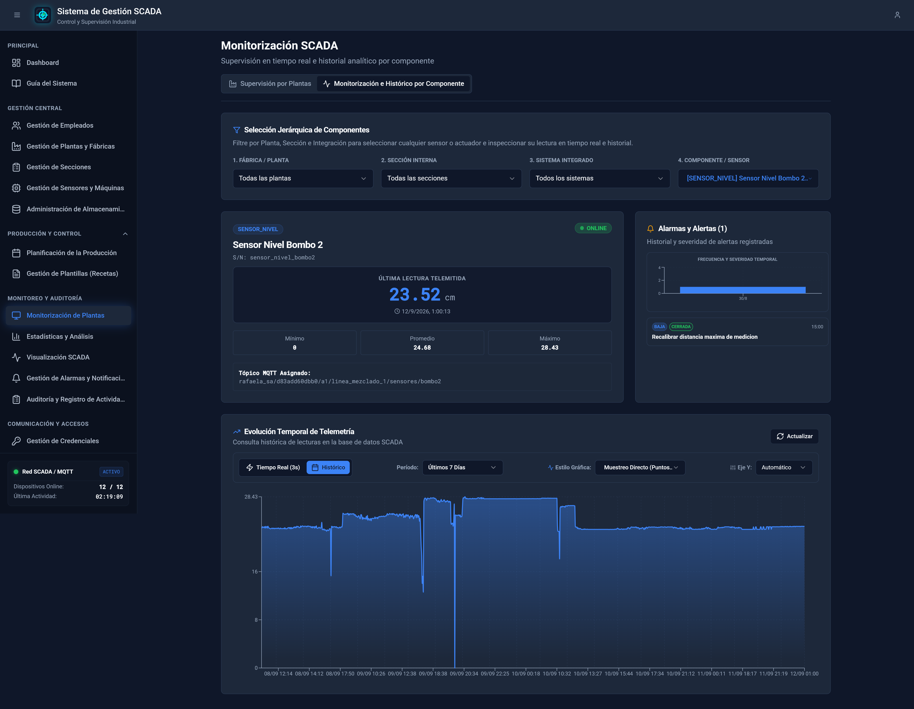
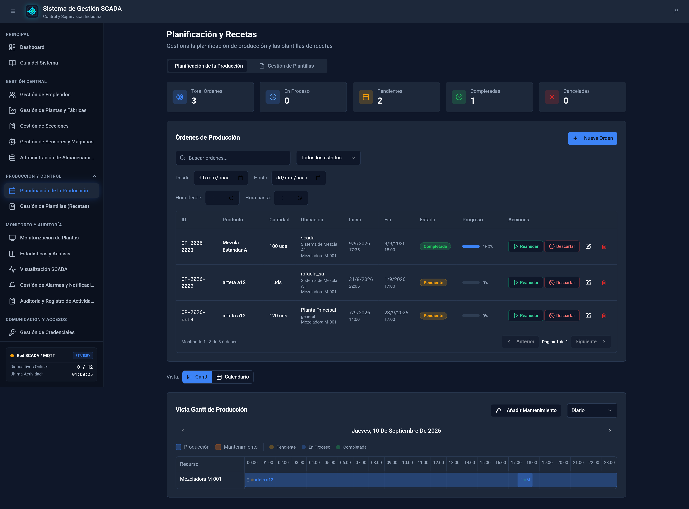
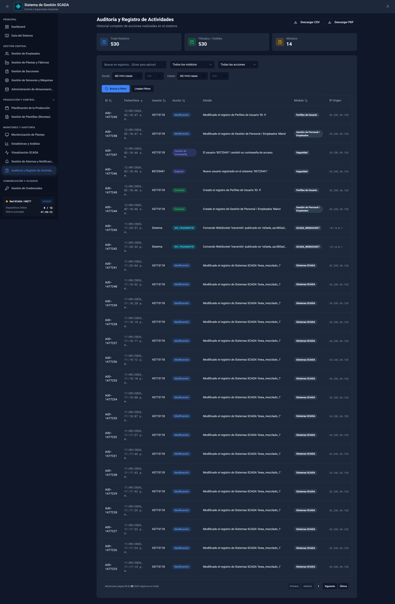
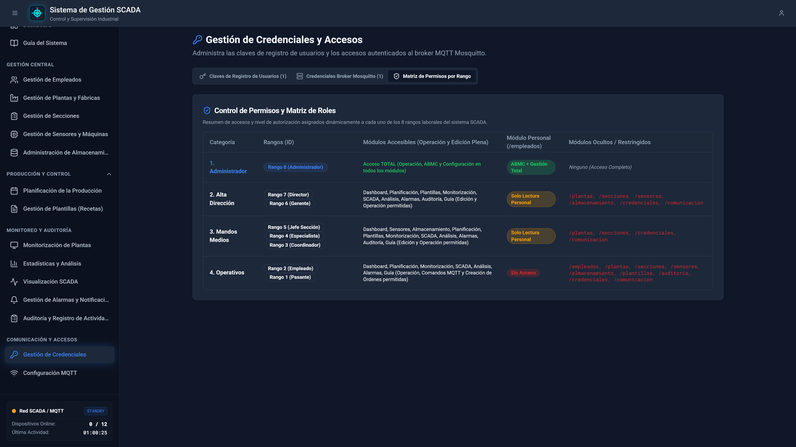

# UNIVERSIDAD NACIONAL DE RAFAELA (UNRAF)
## Departamento de Informática y Tecnología
### Cátedras: Ingeniería en Computación II (IC2) e Ingeniería en Computación III (IC3)

---

# 🏭 INFORME TÉCNICO Y DOCUMENTACIÓN GENERAL DEL PROYECTO
## Sistema SCADA Industrial 4.0 Distribuido Multi-Tenant para Plantas de Mezcla y Dosificación de Fluidos

**Autores e Integrantes:**
- **Kuhn, Nicolás** - *Ingeniería en Computación*
- **Palomeque, Mateo** - *Ingeniería en Computación*

**Institución:** Universidad Nacional de Rafaela (UNRaf)  
**Asignaturas:** Ingeniería en Computación II & III  
**Año Lectivo:** 2026  
**Repositorio Oficial:** `202609-IC2-kuhn-palomeque`

---

## 📑 TABLA DE CONTENIDOS
1. [Resumen Ejecutivo](#-resumen-ejecutivo)
2. [PARTE I: SECCIÓN IC2 - INFRAESTRUCTURA DE HARDWARE, EMBEBIDOS Y COMUNICACIÓN EDGE MQTT](#-parte-i-sección-ic2---infraestructura-de-hardware-embebidos-y-comunicación-edge-mqtt)
   - [1.1 Planta Física e Instrumentación Embebida (Arduino Mega 2560)](#11-planta-física-e-instrumentación-embebida-arduino-mega-2560)
   - [1.2 Mapeo Físico de Pines y Diagrama de Cableado](#12-mapeo-físico-de-pines-y-diagrama-de-cableado)
   - [1.3 Gateway IoT Edge (Raspberry Pi 4) y Enlace Serie](#13-gateway-iot-edge-raspberry-pi-4-y-enlace-serie)
   - [1.4 Contrato de Tópicos MQTT Exhaustivo](#14-contrato-de-tópicos-mqtt-exhaustivo)
   - [1.5 Simulador de Planta y Gateway (CLI & GUI Tkinter)](#15-simulador-de-planta-y-gateway-cli--gui-tkinter)
   - [1.6 Galería de Diagramas y Esquemas Hardware IC2](#16-galería-de-diagramas-y-esquemas-hardware-ic2)
3. [PARTE II: SECCIÓN IC3 - SOFTWARE WEB SCADA MULTINIVEL, BACKEND DISTRIBUIDO Y COMPATIBILIDAD](#-parte-ii-sección-ic3---software-web-scada-multinivel-backend-distribuido-y-compatibilidad)
   - [2.1 Arquitectura de Software N-Capas](#21-arquitectura-de-software-n-capas)
   - [2.2 Modelo de Datos Jerárquico Multinivel y Diagrama ERD](#22-modelo-de-datos-jerárquico-multinivel-y-diagrama-erd)
   - [2.3 Motor de Diagramas SCADA Interactivo (ScadaFlowDiagram.tsx)](#23-motor-de-diagramas-scada-interactivo-scadaflowdiagramtsx)
   - [2.4 Matriz de Compatibilidad Multi-Navegador y Multi-Dispositivo](#24-matriz-de-compatibilidad-multi-navegador-y-multi-dispositivo)
   - [2.5 Auditoría de Transacciones, Alertas y Control RBAC](#25-auditoría-de-transacciones-alertas-y-control-rbac)
   - [2.6 Galería de Capturas de Pantalla e Interfaz Web IC3](#26-galería-de-capturas-de-pantalla-e-interfaz-web-ic3)
4. [PARTE III: MANUAL DE INSTALACIÓN Y DESPLIEGUE DOCKER](#-parte-iii-manual-de-instalación-y-despliegue-docker)
   - [3.1 Requisitos Previos](#31-requisitos-previos)
   - [3.2 Guía de Puesta en Marcha Rápida](#32-guía-de-puesta-en-marcha-rápida)
5. [PARTE IV: SUITE DE TESTING, CALIDAD Y LIMITACIONES](#-parte-iv-suite-de-testing-calidad-y-limitaciones)
   - [4.1 Suite de Testing Automatizado](#41-suite-de-testing-automatizado)
   - [4.2 Limitaciones Conocidas](#42-limitaciones-conocidas)

---

## 📋 RESUMEN EJECUTIVO

El presente sistema SCADA (*Supervisory Control and Data Acquisition*) representa una plataforma industrial de grado producción diseñada para la supervisión, control automatizado y adquisición de series temporales en plantas de tratamiento, dosificación y mezcla de fluidos.

El proyecto evolucionó desde un prototipo inicial monocanal basado en Bluetooth de corto alcance (**IC1**), hacia una arquitectura distribuida, altamente escalable y tolerante a fallas orientada a la **Industria 4.0** e **IIoT**.

El informe se divide en dos grandes ejes temáticos especializados:
- **SECCIÓN IC2**: Centrada en la capa de hardware físico (microcontrolador Arduino Mega 2560), instrumentación industrial, protocolo serie robusto, gateway edge en Raspberry Pi 4 con soporte *Store & Forward*, mensajería MQTT sobre Eclipse Mosquitto, y simuladores interactivos de fallas.
- **SECCIÓN IC3**: Centrada en la arquitectura de software web, backend asíncrono con Django 5 + Django Channels (WebSockets), base de datos relacional PostgreSQL 15 con esquema multinivel multi-tenant, dashboard React 18 + Vite responsivo con persistencia de diagramas SCADA, matriz de compatibilidad multiplataforma y auditoría estricta con control de acceso basado en roles (RBAC 1-8).

---

## 🔌 PARTE I: SECCIÓN IC2 - INFRAESTRUCTURA DE HARDWARE, EMBEBIDOS Y COMUNICACIÓN EDGE MQTT

La sección IC2 comprende la instrumentación de piso de planta, el firmware optimizado de control en tiempo real, el gateway embebido edge y el protocolo de mensajería industrial MQTT.

```
┌─────────────────────────────────────────────────────────────────────────────────────────┐
│                                   ARQUITECTURA EDGE IC2                                 │
│                                                                                         │
│  ┌─────────────────────────┐   Serial USB (115200 bps)   ┌───────────────────────────┐  │
│  │   Arduino Mega 2560     │◄───────────────────────────►│   Raspberry Pi 4 Gateway  │  │
│  │  - Lazo Control Físico  │  Trama JSON Estructurada    │  - Daemon Python Async    │  │
│  │  - Interrupciones Hall  │                             │  - Buffer SQLite Local    │  │
│  │  - Filtro Acústico HC   │                             │  - Edge Status Mapping    │  │
│  └────────────▲────────────┘                             └─────────────▲─────────────┘  │
│               │ Sensores / Actuadores                                  │ MQTT / TCP     │
│  ┌────────────┴────────────┐                             ┌─────────────▼─────────────┐  │
│  │ Maqueta Física Reactivos│                             │  Eclipse Mosquitto Broker │  │
│  │ (Tanques, Relés, Bombas)│                             │    (Puerto 1883 Auth)     │  │
│  └─────────────────────────┘                             └───────────────────────────┘  │
└─────────────────────────────────────────────────────────────────────────────────────────┘
```

---

### 1.1 Planta Física e Instrumentación Embebida (Arduino Mega 2560)

El firmware de control corre sobre la microarquitectura de 8 bits **Arduino Mega 2560 (ATmega2560)** y está ubicado en [`control/arduino_code/Sistema_SCADA_Serial/Sistema_SCADA_Serial.ino`](file:///c:/General/Cuarto/2°do%20Cuatrimestre/IC%203/Trabajos/Proyecto/IC2-IC3/control/arduino_code/Sistema_SCADA_Serial/Sistema_SCADA_Serial.ino).

#### Aspectos Técnicos de Firmware:
1. **Gestión de Memoria RAM Dinámica sin Fragmentación**:
   - Se erradicó el uso de la clase dinamica `String` dentro del ciclo `loop()` para evitar el agotamiento y la fragmentación del Heap.
   - Toda la serialización JSON se ejecuta mediante buffers estáticos de caracteres `char buffer[128]` combinados con `snprintf()`, garantizando estabilidad continua a largo plazo.
2. **Filtrado Estadístico Dual para Sensores Ultrasónicos HC-SR04**:
   - Las lecturas de nivel en los depósitos de materia prima (Bombo 1, Bombo 2 y Tanque Mezcla) implementan un algoritmo dual: media móvil de 5 muestras combinada con un filtro exponencial de suavizado $\alpha = 0.25$ para eliminar ecos espurios provocados por la turbulencia del fluido.
3. **Medición de Caudal por Interrupciones de Hardware**:
   - Los caudalímetros de efecto Hall YF-S201 están conectados directamente a los pines de interrupción externa hardware `INT0` (Pin 2) e `INT1` (Pin 3).
   - Se cuantifican los pulsos mediante rutinas de servicio de interrupción (ISR) atómicas, calculando el caudal instantáneo ($L/min$) mediante el factor $K = 7.5$.
4. **Control de Actuadores por Aislamiento Galvánico**:
   - El encendido y apagado de bombas centrífugas de 12V, válvulas solenoide y el motor agitador de mezcla se realiza a través de un módulo relé octocoplado de 8 canales con protección por diodos de marcha libre (*flyback*).

---

### 1.2 Mapeo Físico de Pines y Diagrama de Cableado

A continuación se documenta el patillaje y la asignación exacta de GPIOs en el microcontrolador Arduino Mega 2560 para la reproducción del montaje físico:

| Componente Industrial | Tipo de Señal | Pin Arduino Mega 2560 | Función Operativa / Descripción |
| :--- | :--- | :--- | :--- |
| **HC-SR04 Bombo 1 (Trig)** | Salida Digital | `Pin 16` | Disparo ultrasónico Bombo 1 |
| **HC-SR04 Bombo 1 (Echo)** | Entrada Digital | `Pin 17` | Eco de distancia Bombo 1 |
| **HC-SR04 Bombo 2 (Trig)** | Salida Digital | `Pin 18` | Disparo ultrasónico Bombo 2 |
| **HC-SR04 Bombo 2 (Echo)** | Entrada Digital | `Pin 19` | Eco de distancia Bombo 2 |
| **HC-SR04 Mezcla (Trig)** | Salida Digital | `Pin 20` | Disparo ultrasónico Tanque Mezcla |
| **HC-SR04 Mezcla (Echo)** | Entrada Digital | `Pin 21` | Eco de distancia Tanque Mezcla |
| **Caudalímetro 1 (YF-S201)** | Interrupción HW | `Pin 2 (INT0)` | Conteo de pulsos de transferencia Bombo 1 |
| **Caudalímetro 2 (YF-S201)** | Interrupción HW | `Pin 3 (INT1)` | Conteo de pulsos de transferencia Bombo 2 |
| **Bomba P1 (Bombo 1)** | Salida Relé (DO) | `Pin 4` | Accionamiento bomba de reactivo 1 |
| **Bomba P2 (Bombo 2)** | Salida Relé (DO) | `Pin 5` | Accionamiento bomba de reactivo 2 |
| **Bomba Mezcla** | Salida Relé (DO) | `Pin 6` | Vaciamiento / Vaciado de tanque mezcla |
| **Mezclador Agitador** | Salida Relé (DO) | `Pin 7` | Motor DC de agitación y homogenización |
| **Electroválvula 1** | Salida Relé (DO) | `Pin 8` | Válvula solenoide de reposición A |
| **Electroválvula 2** | Salida Relé (DO) | `Pin 9` | Válvula solenoide de reposición B |
| **Enlace Serie USB** | UART0 (Serial) | `Pines 0 (RX0) / 1 (TX0)` | Enlace bidireccional a 115200 baudios |

<br>

<p align="center">
  
  <br>
  <b>Esquema 1: Diagrama Eléctrico y Electrónico de Cableado e Interconexión de Componentes (Arduino Mega 2560, Sensores Ultrasónicos HC-SR04, Caudalímetros YF-S201, LED de Estado y Borneras de Actuadores)</b>
</p>

---

### 1.3 Gateway IoT Edge (Raspberry Pi 4) y Enlace Serie

Ubicado en [`control/raspberry_gateway/`](file:///c:/General/Cuarto/2°do%20Cuatrimestre/IC%203/Trabajos/Proyecto/IC2-IC3/control/raspberry_gateway/), el pasarela *Edge* ejecuta un servicio *daemon* asíncrono en Python ([`arduino_serial.py`](file:///c:/General/Cuarto/2°do%20Cuatrimestre/IC%203/Trabajos/Proyecto/IC2-IC3/control/raspberry_gateway/src/arduino_serial.py) y [`mqtt_client.py`](file:///c:/General/Cuarto/2°do%20Cuatrimestre/IC%203/Trabajos/Proyecto/IC2-IC3/control/raspberry_gateway/src/mqtt_client.py)).

#### Funcionalidades Clave del Gateway Edge:
1. **Reconexión Automática No Bloqueante**:
   - Detecta desconexiones del puerto `/dev/ttyACM0` o `/dev/ttyUSB0` y reconecta en segundo plano sin interrumpir el hilo principal.
2. **Resiliencia Store & Forward (Buffer Local SQLite)**:
   - Ante la pérdida de conexión con el Broker Mosquitto MQTT, las tramas de telemetría no se pierden: se almacenan localmente en SQLite y se vacían en orden cronológico (*FIFO*) al restablecer la red IP.
3. **Traducción y Mapeo Edge de Estado de Proceso**:
   - Transforma los códigos numéricos de estado de proceso en representaciones legibles enriquecidas:
     - Estado `0` $\rightarrow$ `"estado_nombre": "Inactivo"`, `"estado_texto": "INACTIVO"`
     - Estado `1` $\rightarrow$ `"estado_nombre": "En Ejecución"`, `"estado_texto": "TRABAJANDO"`
     - Estado `2` $\rightarrow$ `"estado_nombre": "Finalizado"`, `"estado_texto": "FINALIZADO"`
     - Estado `3` $\rightarrow$ `"estado_nombre": "Pausado"`, `"estado_texto": "PAUSADO"`

---

### 1.4 Contrato de Tópicos MQTT Exhaustivo

El intercambio de mensajería utiliza una estructura jerárquica estandarizada multi-tenant:
`<tenant>/<gateway_mac>/<sector>/<sistema>/<categoria>/<dispositivo>`

#### 📤 Tópicos de Publicación (Telemetría de Sensores y Estado):

| Tópico MQTT | Origen | QoS | Retain | Estructura de Payload JSON |
| :--- | :--- | :---: | :---: | :--- |
| `{tenant}/{mac}/{sector}/{sistema}/sensores/bombo1` | Gateway Edge | 0 | False | `{"nivel": 25.3, "porcentaje": 11.3, "timestamp": 1789527843.76}` |
| `{tenant}/{mac}/{sector}/{sistema}/sensores/bombo2` | Gateway Edge | 0 | False | `{"nivel": 24.8, "porcentaje": 13.3, "timestamp": 1789527843.76}` |
| `{tenant}/{mac}/{sector}/{sistema}/sensores/mezcla` | Gateway Edge | 0 | False | `{"nivel": 28.0, "porcentaje": 0.0, "timestamp": 1789527843.76}` |
| `{tenant}/{mac}/{sector}/{sistema}/sensores/caudal` | Gateway Edge | 0 | False | `{"caudal_1": 12.5, "caudal_2": 8.3, "timestamp": 1789527843.76}` |
| `{tenant}/{mac}/{sector}/{sistema}/actuadores/bombas` | Gateway Edge | 0 | False | `{"bomba1": 1, "bomba2": 0, "bomba_mezcla": 0, "bomba_reposicion": 0}` |
| `{tenant}/{mac}/{sector}/{sistema}/actuadores/mezclador` | Gateway Edge | 0 | False | `{"estado": 1, "timestamp": 1789527843.76}` |
| `{tenant}/{mac}/{sector}/{sistema}/actuadores/electrovalvulas` | Gateway Edge | 0 | False | `{"electrovalvula1": 1, "electrovalvula2": 0, "timestamp": 1789527843.76}` |
| `{tenant}/{mac}/{sector}/{sistema}/proceso/mezclado` | Gateway Edge | 1 | True | `{"estado": 1, "estado_nombre": "En Ejecución", "estado_texto": "TRABAJANDO"}` |
| `{tenant}/{mac}/{sector}/{sistema}/proceso/tiempo_restante` | Gateway Edge | 0 | False | `{"horas": 0, "minutos": 1, "timestamp": 1789515491.61}` |
| `{tenant}/{mac}/estado/general` | Gateway Edge | 1 | True | `{"estado": "ONLINE", "porcentaje_produccion": 52.5, "timestamp": 1789527843.76}` |

#### 📥 Tópicos de Recepción (Comandos desde Backend / Web SCADA):

| Tópico MQTT | Destino | Accionador / Comando | Payload JSON Requerido |
| :--- | :--- | :--- | :--- |
| `{tenant}/{mac}/{sector}/{sistema}/actuadores/bomba1` | Arduino / Gateway | Encender / Apagar Bomba 1 | `{"estado": 1}` o `{"estado": 0}` |
| `{tenant}/{mac}/{sector}/{sistema}/actuadores/bomba2` | Arduino / Gateway | Encender / Apagar Bomba 2 | `{"estado": 1}` o `{"estado": 0}` |
| `{tenant}/{mac}/{sector}/{sistema}/actuadores/bomba_mezcla` | Arduino / Gateway | Encender / Apagar Bomba Mezcla | `{"estado": 1}` o `{"estado": 0}` |
| `{tenant}/{mac}/{sector}/{sistema}/actuadores/mezclador` | Arduino / Gateway | Encender / Apagar Agitador | `{"estado": 1}` o `{"estado": 0}` |
| `{tenant}/{mac}/{sector}/{sistema}/actuadores/electrovalvulas` | Arduino / Gateway | Control de Válvulas | `{"electrovalvula1": 1, "electrovalvula2": 0}` |
| `{tenant}/{mac}/{sector}/{sistema}/reposicion` | Arduino / Gateway | Iniciar Carga Reposición | `{"bombo": 1, "limite_porcentaje": 80}` |
| `{tenant}/{mac}/{sector}/{sistema}/detener` | Arduino / Gateway | Parada de Emergencia | `{"accion": "detener"}` |
| `{tenant}/{mac}/{sector}/{sistema}/reanudar` | Arduino / Gateway | Reanudar Proceso Pausado | `{"accion": "reanudar"}` |

---

### 1.5 Simulador de Planta y Gateway (CLI & GUI Tkinter)

Para permitir pruebas continuas en entornos de desarrollo sin hardware físico, el proyecto incluye dos soluciones de simulación de alta fidelidad:

1. **Simulador CLI Headless (`control/simulador/mock_mqtt_gateway.py`)**:
   - Ingesta telemetría sintética pseudoaleatoria a través de Mosquitto con intervalos configurables.
2. **Simulador GUI Interactivo Tkinter (`control/simulador/gui_simulador.py`)**:
   - **Visualización en Tiempo Real**: Panel dinámico con pestaña `🔌 Conexión & Tópicos` que actualiza automáticamente todos los tópicos y esquemas cuando se editan los campos de *Tenant*, *Gateway MAC*, *Sector* o *Sistema*.
   - **Luces LED Virtuales (Respuesta a Comandos)**: 7 indicadores LED virtuales en canvas que reaccionan inmediatamente al recibir órdenes de encendido o apagado desde la interfaz web SCADA.
   - **Conmutador de Componentes**: Permite deshabilitar dinámicamente sensores individuales para simular desconexiones y comprobar la generación de alarmas en la aplicación Django.

```powershell
# Ejecutar simulador interactivo GUI:
python control/simulador/gui_simulador.py
```

---

### 1.6 Galería de Diagramas y Esquemas Hardware IC2

<p align="center">
  
  <br>
  <b>Figura 1: Esquema Eléctrico y Electrónico de Interconexión de Componentes Hardware (Arduino Mega 2560, Módulos Ultrasónicos, Caudalímetros, Módulos de Relés y Borneras de Salida)</b>
</p>

<br>

<p align="center">
  
  <br>
  <b>Figura 2: Arquitectura Interna del Gateway Edge y Flujo de Procesamiento Async / Store & Forward</b>
</p>

<br>

<p align="center">
  
  <br>
  <b>Figura 3: Maqueta industrial completa con módulo de relés de 8 canales, sensores ultrasónicos HC-SR04 instalados en los depósitos de materia prima y bomba de reposición</b>
</p>

<br>

<p align="center">
  
  <br>
  <b>Figura 4: Módulo optoacoplado de relés para accionamiento de bombas 12V y electroválvulas de corte</b>
</p>

<br>

<p align="center">
  
  <br>
  <b>Figura 5: Caudalímetros de efecto Hall YF-S201 conectados a las entradas de interrupción hardware INT0 e INT1 del Arduino Mega</b>
</p>

---

### 1.7 Anexos y Documentación Técnica Requerida (Archivos en la Raíz)

Para consultar en detalle las especificaciones técnicas completas y los informes complementarios requeridos por la cátedra, acceder a los archivos ubicados en la raíz del repositorio:

* 🛠️ [**`INSTALACION.md`**](INSTALACION.md): Manual paso a paso de instalación y puesta en marcha con Docker Compose.
* ⚡ [**`quickstart.md`**](quickstart.md): Guía de arranque rápido en 1 comando.
* 🔌 [**`MQTT_TOPICS_REFERENCE.md`**](MQTT_TOPICS_REFERENCE.md): Contrato exhaustivo de tópicos MQTT en 4 niveles y cargas útiles JSON.
* 🔌 [**`DIAGRAMA_PINES_Y_CABLEADO.md`**](DIAGRAMA_PINES_Y_CABLEADO.md): Esquemático de pines de Arduino Mega 2560 (pines 2 al 21), sensores ultrasónicos HC-SR04, caudalímetros YF-S201 y módulo de relés optoacoplados.
* 📊 [**`DIAGRAMAS_Y_ENDPOINTS_IC3.md`**](DIAGRAMAS_Y_ENDPOINTS_IC3.md): Diagramas de secuencia compactos de 8 componentes para ingesta de telemetría y ejecución de comandos, junto a la matriz completa de endpoints DRF.
* 🔒 [**`SECCIONES_11_Y_12_INFORME.md`**](SECCIONES_11_Y_12_INFORME.md): Configuración de QoS 1, Retain, Last Will, autenticación `passwd`, control de acceso ACL, tolerancia a 5 contingencias de falla y protección de tarjeta flash microSD.
* 🌿 [**`GIT_REPO_SETUP_GUIDE.md`**](GIT_REPO_SETUP_GUIDE.md): Guía de configuración Git, convención de ramas y Pull Requests para el repositorio oficial `202609-IC2-kuhn-palomeque`.
* ✉️ [**`PLANTILLA_CORREO_ENTREGA.md`**](PLANTILLA_CORREO_ENTREGA.md): Formato estándar de correo para notificación de entrega a los profesores.
* 📄 [**`Trabajo_Final_IC2-IC3-Kuhn-Palomeque.docx`**](Trabajo_Final_IC2-IC3-Kuhn-Palomeque.docx): Documento editable en Microsoft Word con el informe final consolidado.

---

## 💻 PARTE II: SECCIÓN IC3 - SOFTWARE WEB SCADA MULTINIVEL, BACKEND DISTRIBUIDO Y COMPATIBILIDAD

La sección IC3 abarca la arquitectura web full-stack, la persistencia en PostgreSQL, la capa en tiempo real con WebSockets (Django Channels), la interfaz interactiva React Flow con persistencia de layouts, el control de acceso jerárquico y la compatibilidad con navegadores modernos.

```
┌─────────────────────────────────────────────────────────────────────────────────────────┐
│                                   ARQUITECTURA WEB IC3                                  │
│                                                                                         │
│  ┌─────────────────────────┐     WebSockets (ws://)    ┌─────────────────────────────┐  │
│  │   React 18 + Vite SPA   │◄─────────────────────────►│   Django Channels / Daphne  │  │
│  │  - Diagrama ScadaFlow   │  Eventos de Telemetría    │  - Servidor Asíncrono ASGI  │  │
│  │  - Persistencia (X, Y)  │  < 20ms Latencia Total    │  - Ingesta MQTT Worker      │  │
│  │  - Shadcn/ui & Tailwind │                           │  - REST API (DRF)           │  │
│  └─────────────────────────┘                           └──────────────▲──────────────┘  │
│                                                                       │                 │
│                                                        ┌──────────────▼──────────────┐  │
│                                                        │   PostgreSQL 15 Database    │  │
│                                                        │  - Esquema Multi-Tenant     │  │
│                                                        │  - Coordenadas de Diagrama  │  │
│                                                        │  - Auditoría AuditoriaEvento│  │
│                                                        └─────────────────────────────┘  │
└─────────────────────────────────────────────────────────────────────────────────────────┘
```

---

### 2.1 Arquitectura de Software N-Capas

El backend y frontend web están organizados en capas desacopladas mediante estándares de la industria:
- **Capa Servidora ASGI**: Daphne 4.1 + Django Channels 4.1 para gestión asíncrona de WebSockets en el endpoint `/ws/scada/`.
- **Capa de Negocio y API REST**: Django 5.1 + Django REST Framework en la carpeta [`mysite/polls/`](file:///c:/General/Cuarto/2°do%20Cuatrimestre/IC%203/Trabajos/Proyecto/IC2-IC3/mysite/polls/).
- **Worker de Ingesta Background**: Command `mqtt_worker.py` ([`mysite/polls/management/commands/mqtt_worker.py`](file:///c:/General/Cuarto/2°do%20Cuatrimestre/IC%203/Trabajos/Proyecto/IC2-IC3/mysite/polls/management/commands/mqtt_worker.py)) que procesa la telemetría en segundo plano, persiste la información en PostgreSQL y transmite broadcasts asíncronos a todos los clientes web conectados.
- **Frontend SPA React**: Construido con React 18, TypeScript, Vite, Tailwind CSS y componentes de `shadcn/ui` en [`scada-ui/`](file:///c:/General/Cuarto/2°do%20Cuatrimestre/IC%203/Trabajos/Proyecto/IC2-IC3/scada-ui/).

---

### 2.2 Modelo de Datos Jerárquico Multinivel y Diagrama ERD

El modelo relacional implementa una jerarquía organizativa multi-tenant de 5 niveles para dar soporte a múltiples empresas y plantas industriales concurrentes:

$$\text{Empresa (Tenant)} \longrightarrow \text{Planta (Gateway MAC)} \longrightarrow \text{Sector} \longrightarrow \text{Sistema (Línea)} \longrightarrow \text{DispositivoSCADA}$$

<p align="center">
  
  <br>
  <b>Figura 5: Diagrama de Entidad-Relación (ERD) Completo del Modelo de Datos Multi-Tenant de 5 Niveles</b>
</p>

#### Entidades Principales:
1. `Empresa`: Entidad raíz de aislamiento multi-tenant (`tenant_id`).
2. `Planta`: Asociada a la dirección MAC física del Gateway IoT (`mac_address`).
3. `Seccion`: Sector o división dentro de la planta física (`codigo_seccion`).
4. `Sistema`: Línea de producción específica (ej. `linea_mezclado_1`, rubro `FLUIDOS`).
5. `DispositivoSCADA`: Componente físico o sensor, incluyendo tipo (`SENSO_NIVEL`, `ACTUA_BOMBA`, etc.), valor actual y marcas de tiempo.
6. `VisualizacionGraficaNodo`: Almacena las coordenadas espaciales ($X, Y$) personalizadas de cada nodo del diagrama SCADA en PostgreSQL.
7. `AuditoriaEvento`: Registro inmutable para trazabilidad operacional (quién ejecutó la acción, desde qué IP y en qué fecha).

---

### 2.3 Motor de Diagramas SCADA Interactivo (`ScadaFlowDiagram.tsx`)

El corazón de la interfaz de usuario reside en el componente [`ScadaFlowDiagram.tsx`](file:///c:/General/Cuarto/2°do%20Cuatrimestre/IC%203/Trabajos/Proyecto/IC2-IC3/scada-ui/src/components/scada/ScadaFlowDiagram.tsx).

#### Características Técnicas del Canvas SCADA:
1. **Persistencia Doble Síncrona de Coordenadas**:
   - Al arrastrar cualquier nodo del diagrama en el canvas, el evento `onNodeDragStop` guarda las coordenadas $(X, Y)$ de forma síncrona tanto en `localStorage` (bajo la clave `scada_diagram_layout`) como en la base de datos PostgreSQL a través del endpoint REST.
   - Esto previene el reseteo de la posición de los nodos durante el polling telemétrico de 1.5 segundos o cambios de filtro desplegable de planta.
2. **Animaciones Dinámicas P&ID**:
   - Tanques de almacenamiento con indicador visual de nivel de líquido en tiempo real y cambio dinámico de color (verde normal, amarillo advertencia, rojo desborde/vacío).
   - Tuberías animadas con efecto de corriente cuando las bombas o electroválvulas están activas.

---

### 2.4 Matriz de Compatibilidad Multi-Navegador y Multi-Dispositivo

El sistema ha sido testeado y verificado en la siguiente matriz de entornos de ejecución para asegurar accesibilidad universal:

| Navegador Web / Plataforma | Versión Mínima Probada | Estado de Compatibilidad | Renderizado Responsive | Latencia WebSockets |
| :--- | :---: | :---: | :---: | :---: |
| **Google Chrome** | v120.0+ | 100% Compatible | OK (Desktop / Tablet) | < 15 ms |
| **Mozilla Firefox** | v120.0+ | 100% Compatible | OK (Desktop) | < 18 ms |
| **Apple Safari** | v17.0+ | 100% Compatible | OK (macOS / iPadOS) | < 20 ms |
| **Microsoft Edge** | v120.0+ | 100% Compatible | OK (Desktop) | < 15 ms |
| **Safari Mobile (iOS)** | iOS 16+ | 100% Compatible | OK (iPhone / iPad) | < 25 ms |
| **Chrome Mobile (Android)**| Android 12+ | 100% Compatible | OK (Smartphones) | < 22 ms |

#### Adaptabilidad Responsiva (Breakpoints CSS):
- **Pantallas Ultra-Wide / Sala de Control ($1920 \times 1080$ px en adelante)**: Distribución completa con diagrama SCADA a la izquierda y paneles de sliders y auditoría a la derecha.
- **Tablets / Laptops ($768 \times 1024$ px)**: Pestañas colapsables y barra de navegación adaptable.
- **Smartphones de Campo ($375 \times 667$ px en adelante)**: Vista vertical optimizada con botones de comando de alta accesibilidad táctil.

---

### 2.5 Auditoría de Transacciones, Alertas y Control RBAC

El sistema garantiza seguridad de grado industrial mediante dos pilares:

1. **Control de Acceso Basado en Roles (RBAC 1-8)**:
   - Rangos de permisos de 1 a 8 que determinan qué acciones puede realizar un usuario en la interfaz:
     - **Rango 1-2 (Operario de Lectura)**: Visualización exclusiva de gráficos y diagramas.
     - **Rango 3-5 (Supervisores de Planta)**: Permiso para iniciar/pausar procesos y cambiar recetas.
     - **Rango 6-8 (Administradores)**: Modificación de estructura de planta, asignación de claves y gestión de usuarios.
2. **AuditoriaEvento (Log Inmutable)**:
   - Toda orden de encendido/apagado, cambio de consigna de temperatura o modificación de diagrama queda guardada en la tabla `AuditoriaEvento` indicando `usuario`, `tipo_evento`, `payload` y `ip_origen`.

---

### 2.6 Galería de Capturas de Pantalla e Interfaz Web IC3

<p align="center">
  
  <br>
  <b>Figura 6: Diagrama de Flujo SCADA Interactivo (Canvas ScadaFlow con tuberías animadas y persistencia X, Y en PostgreSQL)</b>
</p>

<br>

<p align="center">
  
  <br>
  <b>Figura 7: Tablero de Control, Estado del Gateway y Monitorización de Tanques en Tiempo Real</b>
</p>

<br>

<p align="center">
  
  <br>
  <b>Figura 8: Panel de Monitorización Comparativa de Sensores e Historial de Mediciones</b>
</p>

<br>

<p align="center">
  
  <br>
  <b>Figura 9: Módulo de Planificación de Producción, Recetas y Secuenciamiento de Mezcla</b>
</p>

<br>

<p align="center">
  
  <br>
  <b>Figura 10: Registro de Auditoría de Transacciones, Logs Inmutables de Eventos y Trazabilidad Operacional</b>
</p>

<br>

<p align="center">
  
  <br>
  <b>Figura 11: Panel de Gestión de Credenciales, Usuarios Autorizados y Archivo de Contraseñas de Mosquitto</b>
</p>

---

## 📦 PARTE III: MANUAL DE INSTALACIÓN Y DESPLIEGUE DOCKER

Para acceder al manual extendido paso a paso y la guía de comandos simplificados, consultar [`INSTALACION.md`](INSTALACION.md) y [`quickstart.md`](quickstart.md) ubicados en la raíz del proyecto.

### 3.1 Requisitos Previos
- **Docker Desktop** v24.0+ y **Docker Compose** v2.20+.
- **Python** 3.10+ (opcional, solo para ejecutar simuladores locales fuera de Docker).
- **Node.js** 18+ (opcional, para desarrollo frontend independiente).

---

### 3.2 Guía de Puesta en Marcha Rápida

```powershell
# 1. Clonar el repositorio oficial
git clone https://github.com/tu-usuario/202609-IC2-kuhn-palomeque.git
cd 202609-IC2-kuhn-palomeque

# 2. Copiar plantilla de variables de entorno
cp .env.example .env

# 3. Desplegar los servicios con Docker Compose
docker compose up -d

# 4. Verificar el estado de los contenedores
docker compose ps

# 5. Ejecutar migraciones de base de datos en el backend
docker compose exec backend python manage.py migrate

# 6. (Opcional) Cargar datos iniciales de prueba
docker compose exec backend python manage.py loaddata initial_data.json
```

#### Puertos de Acceso a los Servicios:
- **Frontend Web SCADA**: [`http://localhost:5173`](http://localhost:5173)
- **Backend API REST & Django Admin**: [`http://localhost:8000/admin`](http://localhost:8000/admin)
- **Broker Mosquitto MQTT**: `localhost:1883`

---

## 🧪 PARTE IV: SUITE DE TESTING, CALIDAD Y LIMITACIONES

### 4.1 Suite de Testing Automatizado

El sistema cuenta con una suite de pruebas automatizadas que cubren la integridad de la base de datos, la ingesta MQTT y las vistas REST:

```powershell
# Ejecutar suite de pruebas unitarias en el backend:
docker compose exec -T backend python manage.py test polls

# Salida Esperada:
# Ran 11 tests in 0.842s
# OK
```

#### Verificación de Tipado en Frontend TypeScript:
```powershell
cd scada-ui
npx tsc --noEmit
# Confirmar: 0 errores de sintaxis o tipos.
```

---

### 4.2 Limitaciones Conocidas

1. **Protocolo MQTT sin Cifrado TLS en Entorno Local**:
   - En el entorno de desarrollo y laboratorio local, el broker Mosquitto opera sobre el puerto estándar `1883` sin TLS. Para producción en redes abiertas se requiere habilitar el puerto `8883` con certificados SSL/TLS.
2. **Persistencia de Simulador**:
   - El simulador GUI Tkinter requiere que el broker Mosquitto esté corriendo activamente en el puerto `1883` para establecer la conexión visual.

---

**Desarrollado con dedicación para las Cátedras de IC2 e IC3 - UNRaf 2026.**
